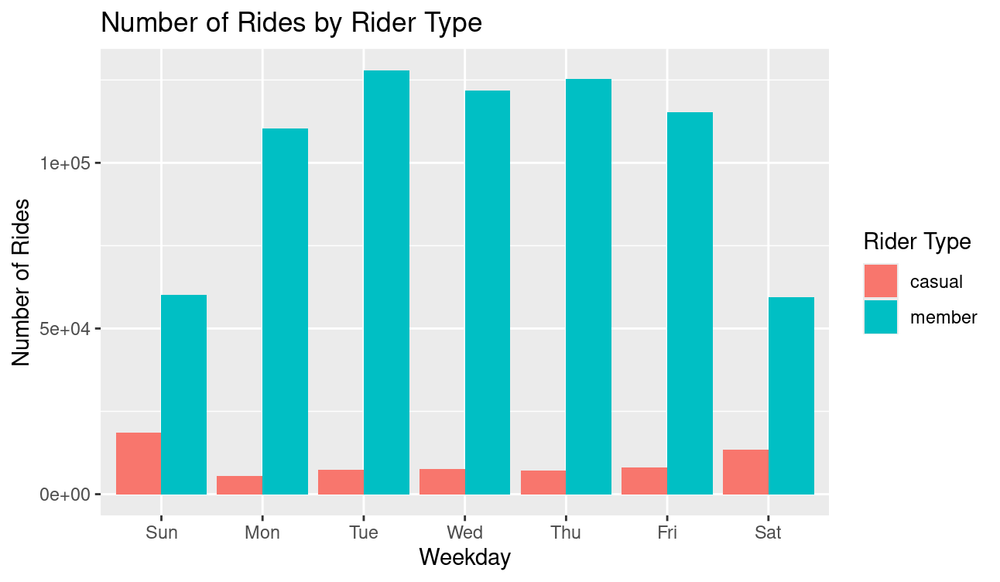
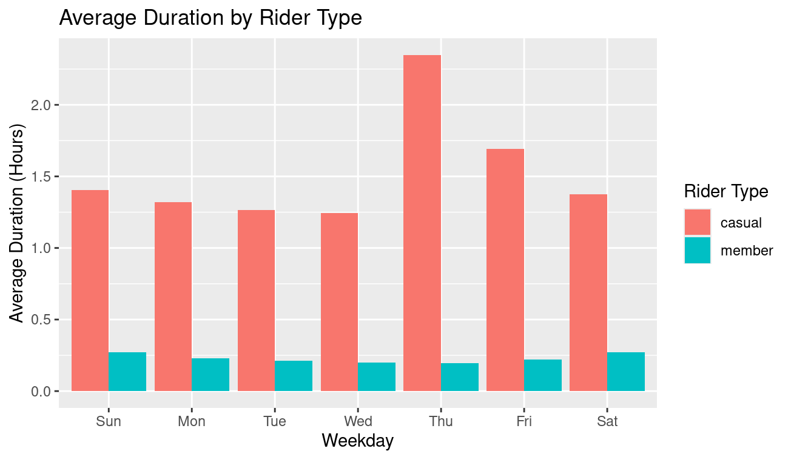
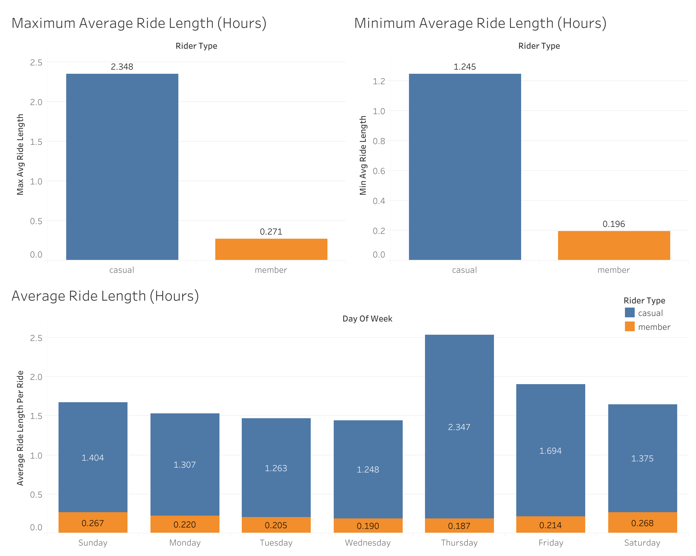
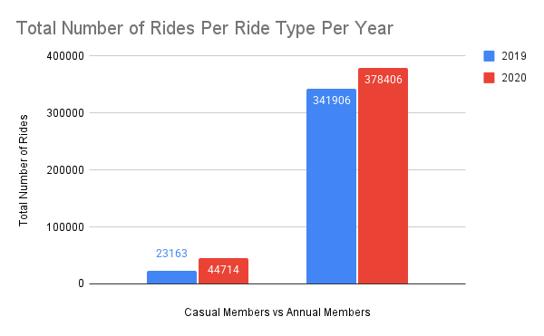

# Cyclistic

## Introduction

In this project I will be examining the Cyclistic Bike Share Case Study which is a capstone project for the Google Data Analytics Professional Certificate. I will examine this case study and address key buisness qurstions using the different steps I learned from the course including; to ask, prepare, process, analyze, share and act. 

## Background

Cycalistic is a bike share program in Chicago that features 5,824 bicycles and 692 docking stations across the city. What separates Cyclistic and other bike sharing companies is that they don't only have customary bicycles they also carry cyclistic bicycles. Cyclystic biscycles include reclining bikes, hand tricycles and cargo bikes. These options make bike sharing more inclusive to those with disabilities or those who can't use a standard two-wheeled bike. Cyclystics' vast array of different bicycles and stations allow citizens to travel conveniently throughout the city and with ease.

In addition to offering Cyclystic bikes, Cyclystic also maintains flexibility in their pricing plans. Cyclystic offers single-ride pass, full-day pass and annual memberships illustrating the company's effort to appeal to broad consumer segments. These changes are important to implement however Cyclystics marketing director believes that by maximizing the number of annual memberships the company will succeed in the future. In order to fully understand how to maximize annual memberships, we must first differentiate between casual riders (those who use the app without a membership) and our annual members. Through analyzing what separates the two groups I can help Cyclystic design a new marketing strategy to maximize conversions of casual riders into annual members.

## Scenario

In this hypothetical case study I am a junior data analyst wokring on the marketing analyst team at Cyclistic and will be presentiing my findings as well as possible solutions to key stakeholders such as Lily Moreno the director of marketting, as well as the cyclistic executive team. My report will specifically entail a clear statment on the buisness task, a descruption of data used, documentation of cleaning or manipulation of data, a summary of analysis, supporting vizualizations and my top three reccomendations based on my analysis.  

## Ask

When approaching the ask section it is vital to understand the buisness task and to consider key stakeholders. The buisness task or what we will be trying to solve is how annual members and casual riders use ciclystic bikes differentky. After we find these differences we will then be able to explore ideas on how the company can covert the casual riders into annual members. 

## Prepare

### Data Source

When approaching the prepare section its crtical to ensure data is reliable, original, comprehensive, current and cited. The data being used comes from Cyclistics divvy trip data pertaining to both 2019 Q1 and 2020 Q1 and has been made available by Motivate International Inc. under their Data License Agreement (make link clickable). Because R was used for organization and analysis only Q1 was accessable and will not containe data concerning Q2, Q3, or Q4.

The data is public and can be used to investigate how different customer types are using Cyclistic bikes. In in order to comply with data pprivacy issues the data excludes riders personally idneitfiable information including names or finnacial details. 

In order to determine wheither or not the data source is relaible, original, comprehensive, current and cited we will follow the ROCCC framwork. We know the data is reliable and original ebcause it contains accurate, complete and inbiased information on Cyclysitcs historicak bike trips which come from a prumary source. The data also contains all infmation neede to undestand the different ways annual and casual riders use Cyclistic bikes making it quite comprehensive. Adddionally because the data sources are provided publicially by Cyclistic it can be refrenced easily. Finally even though our data is 5-6 years old it is still young enough for our analysis. 

### Data Information and Organization

Datasets for Q1 of 2019 and 2020 were downloaded from the cloud and stored on my harddrive. They were then imported into Google Drive to examine in Google sheets and then imported to R studio for processing. After pprocessing the data, it was finally exported to Tableau for vizualization

Each file includes the months of January February and March but use sevieral different column names. The different columns were edtied to match eachother in order to compare the two years. 

## Process

When approaching the process stage its essential to purge the data ensuring accuracy and eliminating any incomplte entres. It is equally as vital to ensure consistnecy across all of the datas elements in order to analyze the data sucessfully.  

### Step 1:

I first opneed each .csv ans saved them to the appropriate subfolder in order to have a copy of the
original data. After saving each .csv to the subfolder I imported the data and installed the necessary packages.

```r
install.packages("tidyverse")
library(tidyverse)  #helps wrangle data

# Use the conflicted package to manage conflicts
library(conflicted)

# Set dplyr::filter and dplyr::lag as the default choices
conflict_prefer("filter", "dplyr")
conflict_prefer("lag", "dplyr")
```

### Step 2: 

I then uploaded the files to R Studio to clean the data further.

```r
q1_2019 <- read_csv("Divvy_Trips_2019_Q1 - Divvy_Trips_2019_Q1.csv")
q1_2020 <- read_csv("Divvy_Trips_2020_Q1 - Divvy_Trips_2020_Q1.csv")
```
### Step 3:

Once I had both files on R studio I was able to wrangle both into a single file by renaming the collunns and converting data types to ensure they stack correctly. After stacking the data frames I then removed any inconsistencies between the two files. 

```r
# Rename columns to make them consistent with q1_2020
(q1_2019 <- rename(q1_2019
                   ,ride_id = trip_id
                   ,rideable_type = bikeid
                   ,started_at = start_time
                   ,ended_at = end_time
                   ,start_station_name = from_station_name
                   ,start_station_id = from_station_id
                   ,end_station_name = to_station_name
                   ,end_station_id = to_station_id
                   ,member_casual = usertype))

# Inspect the dataframes and look for incongruencies
str(q1_2019)
str(q1_2020)

# Convert ride_id and rideable_type to character so that they can stack correctly
q1_2019 <-  mutate(q1_2019, ride_id = as.character(ride_id)
                   ,rideable_type = as.character(rideable_type)) 

# Stack individual quarter's data frames into one big data frame
all_trips <- bind_rows(q1_2019, q1_2020)

# Remove lat, long, birthyear, and gender fields as this data was dropped beginning in 2020
all_trips <- all_trips %>%  
  select(-c(start_lat, start_lng, end_lat, end_lng, birthyear, gender,  "tripduration"))
```

### Step 4:

I then cleaned and added more data to prepare for the analysis stage.

```r
# Reassign to the desired values (using the current 2020 labels)
all_trips <-  all_trips %>% 
  mutate(member_casual = recode(member_casual,"Subscriber" = "member","Customer" = "casual"))

# Add columns that list the date, month, day, and year of each ride: allowing you to aggregate ride data for each moth, day or year.
all_trips$date <- as.Date(all_trips$started_at)
all_trips$month <- format(as.Date(all_trips$date), "%m")
all_trips$day <- format(as.Date(all_trips$date), "%d")
all_trips$year <- format(as.Date(all_trips$date), "%Y")
all_trips$day_of_week <- format(as.Date(all_trips$date), "%A")

# Add a "ride_length" calculation to all_trips
all_trips$ride_length <- difftime(all_trips$ended_at,all_trips$started_at, units = "hours")

# Inspect the structure of the columns
str(all_trips)

# Convert "ride_length" from Factor to numeric
is.factor(all_trips$ride_length)
all_trips$ride_length <- as.numeric(as.character(all_trips$ride_length))
is.numeric(all_trips$ride_length)

# Remove "bad" data, the dataframe includes a few hundred entries when bikes were taken out of docks and checked for quality by Divvy or ride_length was negative
# You will create a new version of the dataframe (v2) since data is being removed
all_trips_v2 <- all_trips[!(all_trips$start_station_name == "HQ QR" | all_trips$ride_length<0),]
```

## Analyze

### Step 5: 

After finishing cleaning and adding more data I was finally able to conduct a descriptive analysis.

```r
# Descriptive analysis on ride_length 
mean(all_trips_v2$ride_length) #straight average (total ride length / rides)
[1] 1189.459
median(all_trips_v2$ride_length) #midpoint number in the ascending array of ride lengths
[1] 539
max(all_trips_v2$ride_length) #longest ride
[1] 10632022
min(all_trips_v2$ride_length) #shortest ride
[1] 1

# You can condense the four lines above to one line using summary() on the specific attribute
summary(all_trips_v2$ride_length)
    Min.  1st Qu.   Median     Mean  3rd Qu.     Max. 
       1      331      539     1190      912 10632022 

# Compare members and casual users
aggregate(all_trips_v2$ride_length ~ all_trips_v2$member_casual, FUN = mean)
  all_trips_v2$member_casual all_trips_v2$ride_length
1                     casual                5372.7839
2                     member                 795.2523
aggregate(all_trips_v2$ride_length ~ all_trips_v2$member_casual, FUN = median)
  all_trips_v2$member_casual all_trips_v2$ride_length
1                     casual                     1393
2                     member                      508
aggregate(all_trips_v2$ride_length ~ all_trips_v2$member_casual, FUN = max)
  all_trips_v2$member_casual all_trips_v2$ride_length
1                     casual                 10632022
2                     member                  6096428
aggregate(all_trips_v2$ride_length ~ all_trips_v2$member_casual, FUN = min)
  all_trips_v2$member_casual all_trips_v2$ride_length
1                     casual                        2
2                     member                        1

# Run the average ride time by each day for members vs casual users
aggregate(all_trips_v2$ride_length ~ all_trips_v2$member_casual + all_trips_v2$day_of_week, FUN = mean)
   all_trips_v2$member_casual all_trips_v2$day_of_week
1                      casual                   Friday
2                      member                   Friday
3                      casual                   Monday
4                      member                   Monday
5                      casual                 Saturday
6                      member                 Saturday
7                      casual                   Sunday
8                      member                   Sunday
9                      casual                 Thursday
10                     member                 Thursday
11                     casual                  Tuesday
12                     member                  Tuesday
13                     casual                Wednesday
14                     member                Wednesday
all_trips_v2$ride_length
1                 6090.7373
2                  796.7338
3                 4752.0504
4                  822.3112
5                 4950.7708
6                  974.0730
7                 5061.3044
8                  972.9383
9                 8451.6669
10                 707.2093
11                4561.8039
12                 769.4416
13                4480.3724
14                 711.9838

# Notice that the days of the week are out of order. Let's fix that.
all_trips_v2$day_of_week <- ordered(all_trips_v2$day_of_week, levels=c("Sunday", "Monday", "Tuesday", "Wednesday", "Thursday", "Friday", "Saturday"))

# Now, let's run the average ride time by each day for members vs casual users
aggregate(all_trips_v2$ride_length ~ all_trips_v2$member_casual + all_trips_v2$day_of_week, FUN = mean)
   all_trips_v2$member_casual all_trips_v2$day_of_week all_trips_v2$ride_length
1                      casual                   Sunday                5061.3044
2                      member                   Sunday                 972.9383
3                      casual                   Monday                4752.0504
4                      member                   Monday                 822.3112
5                      casual                  Tuesday                4561.8039
6                      member                  Tuesday                 769.4416
7                      casual                Wednesday                4480.3724
8                      member                Wednesday                 711.9838
9                      casual                 Thursday                8451.6669
10                     member                 Thursday                 707.2093
11                     casual                   Friday                6090.7373
12                     member                   Friday                 796.7338
13                     casual                 Saturday                4950.7708
14                     member                 Saturday                 974.0730

# Analyze ridership data by type and weekday
all_trips_v2 %>% 
+   mutate(weekday = wday(started_at, label = TRUE)) %>%  #creates weekday field using wday()
+   group_by(member_casual, weekday) %>%  #groups by usertype and weekday
+   summarise(number_of_rides = n()							#calculates the number of rides and average duration 
+             ,average_duration = mean(ride_length)) %>% 		# calculates the average duration
+   arrange(member_casual, weekday)								# sorts
`summarise()` has grouped output by 'member_casual'. You can override using the `.groups` argument.
# A tibble: 14 × 4
# Groups:   member_casual [2]
   member_casual weekday number_of_rides average_duration
   <chr>         <ord>             <int>            <dbl>
 1 casual        Sun               18652            5061.
 2 casual        Mon                5591            4752.
 3 casual        Tue                7311            4562.
 4 casual        Wed                7690            4480.
 5 casual        Thu                7147            8452.
 6 casual        Fri                8013            6091.
 7 casual        Sat               13473            4951.
 8 member        Sun               60197             973.
 9 member        Mon              110430             822.
10 member        Tue              127974             769.
11 member        Wed              121902             712.
12 member        Thu              125228             707.
13 member        Fri              115168             797.
14 member        Sat               59413             974.
```

### Step 6:

After running my descriptive analysis I was able to collect my findings

#### All riders ride length (seconds)

* Mean: 1190
* Median: 539
* Max: 10632022
* Min: 1

#### Casual vs Member ride length (seconds)

Mean
* Casual: 1393
* Member: 795

Median
* Casual: 1393
* Member: 508

Max
* Causal: 10632022
* Member: 6096428

Min
* Casual: 2
* Member: 1

### Step 7:

Finally I will visualize the data through visuals from R Studio as well as Tableau.

```r
# Visualize the number of rides by rider type
all_trips_v2 %>% 
  mutate(weekday = wday(started_at, label = TRUE)) %>% 
  group_by(member_casual, weekday) %>% 
  summarise(number_of_rides = n()
            ,average_duration = mean(ride_length)) %>% 
  arrange(member_casual, weekday)  %>% 
  ggplot(aes(x = weekday, y = number_of_rides, fill = member_casual)) +
  geom_col(position = "dodge")

# Create a visualization for average duration
all_trips_v2 %>% 
  mutate(weekday = wday(started_at, label = TRUE)) %>% 
  group_by(member_casual, weekday) %>% 
  summarise(number_of_rides = n()
            ,average_duration = mean(ride_length)) %>% 
  arrange(member_casual, weekday)  %>% 
  ggplot(aes(x = weekday, y = average_duration, fill = member_casual)) +
  geom_col(position = "dodge")
```




Visualizations in R studio are useful however Tableau has more sophisticated graphics and tools that can allow us to visualize the data in a more clear light. In order to further visulize the data in Tableau we first need to create a csv file of the processed infromation from R Studio.

```r
# Create a csv file that we will visualize in Google Slides, Tableau, and my presentation software
counts <- aggregate(all_trips_v2$ride_length ~ all_trips_v2$member_casual + all_trips_v2$day_of_week, FUN = mean)
write.csv(counts, file = 'avg_ride_length.csv')
write.csv(all_trips_v2, file = 'all_trips_v2.csv')
```
After downloading the csv file I was able to import the data into Tableau and create calculated fields using existing variables in order to visualize data in a different light. The new calculated fields included the averaege ride time in hours per customer based on the day of the week as well as the minimum and maximum average ride lengths based on rider type. Below are the visualizations I made in Tableau using the csv file I just created. 



Additonally I decuded to further analyze the data in Google Sheets by using the same CSV file used in Tableau. Using google sheets I deicded to calculate the total number of riders per year based on their Rider Type. From there I was able to calculate the percent diffirence between rider types and year on total number of rides taken.




